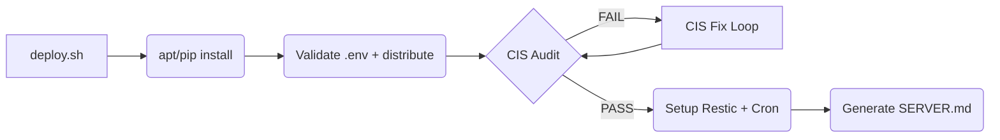
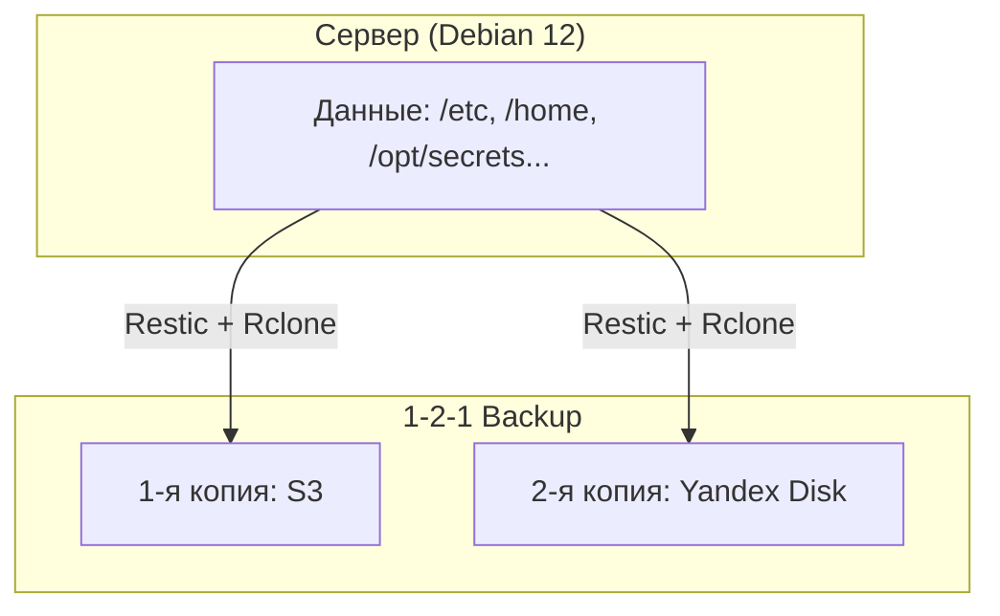

# base-mais-server-setup

[](LICENSE)
[](https://www.debian.org/)
[](https://www.python.org/)
[](https://www.cisecurity.org/benchmark/debian_linux)

**Превратите голый VPS в production-ready сервер за 5 минут. CIS Benchmark, 1-2-1 backup (S3 + Yandex Disk), секреты из локального .env — одной командой.**

## 📑 Содержание
- [Проблема и решение](#-ваш-новый-vps--это-бомба-замедленного-действия)
- [Что вы получите за 5 минут](#-что-вы-получите-за-5-минут)
- [Архитектура и Pipeline](#-архитектура-и-pipeline)
- [Требования (Prerequisites)](#️-требования-prerequisites)
- [Быстрый старт](#-быстрый-старт)
- [Конфигурация](#-конфигурация)
- [Ручное управление](#-ручное-управление)
- [Troubleshooting](#-troubleshooting)
- [Структура проекта](#-структура-проекта)

---

## 🚨 Ваш новый VPS — это бомба замедленного действия

Вы только что создали новый VPS в облаке. Он голый. И вот что вам предстоит сделать, прежде чем он станет безопасным:

❌ **Потратить 4-8 часов** на ручную настройку SSH, firewall, kernel hardening.  
❌ **Разобраться в 59 пунктах CIS Benchmark**, чтобы не пропустить критическую уязвимость.  
❌ **Настроить backup стратегию** с несколькими облачными провайдерами и rotation policy.  
❌ **Придумать, как хранить секреты** без `.env` файлов в репозитории.

**Результат?** Вы либо тратите целый день на рутину, либо (что чаще) пропускаете критичные шаги и надеетесь на лучшее.

### 💀 Цена ошибки
- 🔓 **Взлом через дефолтный SSH** — и ваш проект принадлежит хакерам.
- 💥 **Сбой диска без бэкапа** — и вы теряете месяцы работы и клиентов.
- 📋 **Проваленный аудит compliance** — и вы теряете контракты с enterprise-клиентами.

### ✅ Решение: Production-Ready за 5 минут

Этот проект делает за вас всю грязную работу. Запустите `deploy.sh` — и через 5 минут у вас:

✅ **CIS Debian 12 Level 1** — 59 автоматических проверок безопасности (SSH, UFW, nftables).  
✅ **1-2-1 Backup** — ежедневные бэкапы в S3 и Yandex Disk с автоматическим rotation.  
✅ **Local Secret Management** — все пароли и ключи в `.env` (chmod 600), автоматически распределяются в `/opt/secrets/`.  
✅ **Auto-Documentation** — живой `SERVER.md` с актуальным состоянием вашей инфраструктуры.

### 🎯 Для кого это?

- **👨‍💻 Разработчики и Indie Hackers**: Запускайте pet-projects и стартапы без необходимости быть сисадмином.
- **🛡 DevOps и Sysadmins**: Единый стандарт для всей команды. Новые серверы настраиваются за 5 минут, а не за 5 часов.
- **🏢 Технические лидеры и CTO**: Гарантированный compliance и единый стандарт безопасности во всей инфраструктуре.

---

## 🎁 Что вы получите за 5 минут

| Компонент | Что делает | Бизнес-ценность |
|-----------|------------|-----------------|
| **CIS Hardening** | Автоматическое применение 59 проверок Level 1 | Защита от 95% типичных атак, прохождение аудитов |
| **1-2-1 Backup** | S3 + Yandex Disk с rotation, без локальной копии | RPO < 24h, RTO < 1h, защита от ransomware, экономия SSD |
| **Local Secrets** | `.env` → `/opt/secrets/` с chmod 600 | Никаких секретов в репозитории, никаких внешних зависимостей |
| **ZRAM** | Сжатый swap в RAM (zstd, 50% RAM) | Нет I/O wait от swap на SSD, защита от OOM |
| **Auto-Documentation** | Генерация `SERVER.md` с live-данными | Всегда актуальная документация для команды |

---

## 🏗 Архитектура и Pipeline

### Deployment Pipeline


### Стратегия 1-2-1 Backup


---

## ⚙️ Требования (Prerequisites)

Перед запуском убедитесь, что у вас подготовлено:

1. **Чистый сервер** с Debian 12 и доступом по SSH (root или sudo).
2. **Локальный `.env` файл** — создайте его в корне репозитория (см. [Секреты](#-секреты)).
3. **S3** — Object Storage bucket для первой копии backup.
    - ✅ **Опционально.** Работает только с Yandex Disk
4. **Yandex Disk** — OAuth-токен с правами на запись.
    - ✅ **Опционально.** Работает только с S3

---

## 🚀 Быстрый старт

### Вариант 1: AI Employee (агент)
Скопируйте этот промпт в новую сессию с вашим AI-агентом:

```text
Привет! Настрой сервер по этому репозиторию: https://github.com/mlenkov/base-mais-server-setup

Данные для подключения:
IP: <ip>
SSH user: <user>
SSH key: <path>
```
*Агент сам подключится, установит git, склонирует репо, запустит `deploy.sh` и вернёт отчёт.*

### Вариант 2: Вручную

**1. Подключитесь к серверу и склонируйте репозиторий:**
```bash
ssh user@host
sudo apt update && sudo apt install -y git
git clone https://github.com/mlenkov/base-mais-server-setup.git .
```

**2. Создайте `.env` файл** (см. раздел [Секреты](#-секреты)).

**3. Запустите `deploy.sh`:**
```bash
sudo bash deploy/deploy.sh
```

> [!WARNING]
> **Безопасность:** `.env` файл автоматически получает права chmod 600 и никогда не должен попадать в репозиторий. Проверьте `.gitignore`.

---

## 📝 Конфигурация

### `backup/config.yaml` — что и куда бэкапить
```yaml
backup:
  sources:              # что бекапим — добавьте свои директории
    - /etc
    - /home
    - /opt/secrets

  schedule: "0 2 * * *"  # ежедневно в 2:00

  retention:              # политика хранения
    keep_daily: 7
    keep_weekly: 4
    keep_monthly: 3

  s3:                     # Copy 1: S3 Object Storage
    bucket: ""            # имя бакета
    endpoint: ""          # URL (без https://)
    prefix: ""            # префикс внутри бакета (опционально)
    region: ru-central-1

  yandex_disk:            # Copy 2: Yandex Disk (offsite)
    path: /backups/base-mais-server-setup
```

### Секреты

Создайте файл `.env` в корне проекта:

```bash
cat > .env << 'EOF'
RESTIC_PASSWORD='мой_надёжный_пароль'
S3_ACCESS_KEY='s3_access_key'
S3_SECRET_KEY='s3_secret_key'
S3_BUCKET='my-bucket'
S3_ENDPOINT='s3.cloud.ru'
YANDEX_DISK_TOKEN='yandex_oauth_token'
BIFROST_OPENAI_KEY='sk-...'
EOF
chmod 600 .env
```

**Правила:**
- Обязателен только `RESTIC_PASSWORD` — без него backup не работает никуда
- Остальные ключи опциональны — соответствующий сервис будет пропущен
- Переменные с префиксом (`BIFROST_*`, `MYAPP_*`) попадают в `/opt/secrets/<app>.env`
- `.env` не должен быть в репозитории (gitignored)

---

## 🛠 Ручное управление

> [!NOTE]
> Эти команды предназначены для продвинутого использования, отладки и ежедневных операций. Для первичной настройки достаточно `deploy.sh`.

### `deploy/deploy.sh` — полный pipeline (entry point)
**Что делает:** Установка одной командой. Зависимости, секреты, ZRAM, CIS fix, backup, документация.
После завершения удаляет себя и CI/CD артефакты с сервера.
**Когда использовать:** Первичная настройка или полный reset сервера.

```bash
sudo bash deploy/deploy.sh
```

### `cis/manager.py` — CIS аудит и исправление
**Что делает:** Проверяет compliance по 59 пунктам CIS Benchmark и применяет исправления.
**Когда использовать:** Регулярные аудиты, откат изменений, форсированное применение fixes.

```bash
python3 cis/manager.py audit           # проверить compliance (59 проверок)
python3 cis/manager.py fix --force     # применить исправления
python3 cis/manager.py rollback        # откатить последний fix
```

### `backup/backup.py` — управление 1-2-1 backup
**Что делает:** Создание, проверка и восстановление бэкапов по стратегии 1-2-1.
**Когда использовать:** Ручной запуск бэкапа, проверка статусов, аварийное восстановление.

```bash
python3 backup/backup.py create        # создать backup (S3 + Yandex)
python3 backup/backup.py status        # статус репозитория и cron
python3 backup/backup.py list          # список snapshot-ов
python3 backup/backup.py restore       # восстановить из последнего snapshot
```
*Backup автоматически запускается по cron в 2:00 ежедневно.*

### `deploy/secrets.py` — управление секретами
**Что делает:** Валидирует `.env` и распределяет секреты в `/opt/secrets/`.
**Когда использовать:** После изменения `.env`, при первичной настройке.

```bash
python3 deploy/secrets.py sync         # валидация + распределение в /opt/secrets/
python3 deploy/secrets.py validate     # только валидация .env
python3 deploy/secrets.py template     # создать шаблон .env
```

### `deploy/tests/test_deploy.py` — тест deployment пайплайна (SSH)
**Что делает:** Подключается к серверу через `docs/connection.md`, загружает проект,
запускает deploy, проверяет compliance. При неудаче — откат снапшота и retry-петля.
**Когда использовать:** Перед внесением изменений в pipeline.

```bash
sudo python3 deploy/tests/test_deploy.py                # полный цикл с retry
sudo python3 deploy/tests/test_deploy.py --attempts 5   # максимум 5 попыток
```

### Утилиты
```bash
python3 cis/check_compliance.py        # Быстрая проверка ключевых параметров безопасности
python3 deploy/docs_generator.py       # Генерация docs/SERVER.md (live данные сервера)
```

---

## 🚑 Troubleshooting

| Симптом | Причина | Решение |
|---------|---------|---------|
| `dpkg conffile prompt` | Пакет перезаписывает конфиг | `DEBIAN_FRONTEND=noninteractive` (уже в `deploy.sh`) |
| `pip install` fails | Выход из venv | Активируйте `/opt/provisioning-venv/bin/activate` |
| ZRAM не активен | `zram-tools` не настроен | `zramctl` — проверьте статус, `systemctl restart zramswap` |
| Compliance < 100% | Fix не применился | `audit` → `fix --force` → `audit` (цикл) |
| `.env not found` | Нет .env файла | `python3 deploy/secrets.py template`, заполните, запустите снова |
| No space left | Логи или apt кеш | `apt clean && journalctl --vacuum-time=7d` |
| `restore` не работает | Блокировка restic | `restic check && restic unlock` |
| S3 quota exceeded | Превышен лимит хранилища | Уменьшите `keep_daily` в `backup/config.yaml` |

---

## 📂 Структура проекта

```text
deploy/                 # Провижининг (однократно, удаляется после deploy)
├── deploy.sh           # Оркестратор
├── secrets.py          # Local .env manager
├── docs_generator.py   # Генерация SERVER.md
├── templates/
│   └── server.md       # Шаблон документации
└── tests/
    ├── test_deploy.py  # SSH оркестрация + retry
    └── test_secrets.py # Unit тесты
cis/                    # Безопасность (на сервере постоянно)
├── manager.py          # CIS audit + fix
├── standard.yaml       # 59 CIS проверок
├── check_compliance.py # Проверка compliance score
└── data/               # Результаты аудита (gitignored)
backup/                 # Бэкапы (на сервере постоянно)
├── backup.py           # 1-2-1 backup (restic + S3 + Yandex Disk)
└── config.yaml         # Настройки backup
docs/
├── SERVER.md           # gitignored
├── connection.md       # gitignored
├── GUIDE.md            # Полное руководство
└── adr/                # Architectural Decision Records
AGENTS.md               # Инструкции для AI Employee
README.md               # Этот файл
```

---

## 📚 Документация

- **`AGENTS.md`** — инструкции и промпты для AI Employee.
- **`docs/GUIDE.md`** — полное руководство: архитектура, ежедневные операции, restore.
- **`docs/SERVER.md`** *(gitignored)* — live-данные сервера (HW, IP, CIS), генерируется автоматически.
- **`docs/connection.md`** *(gitignored)* — IP/user/key, заполняет агент.
- **`docs/adr/`** — Architectural Decision Records (история принятых решений).

---

## 🤝 Contributing & License

Если вы нашли ошибку или хотите предложить улучшение, пожалуйста, откройте [Issue](https://github.com/mlenkov/base-mais-server-setup/issues) или создайте Pull Request.

Проект распространяется под лицензией [MIT](LICENSE).

---

**Готовы превратить свой VPS в production-ready сервер за 5 минут?**  
Начните с [Быстрого старта](#-быстрый-старт) →
